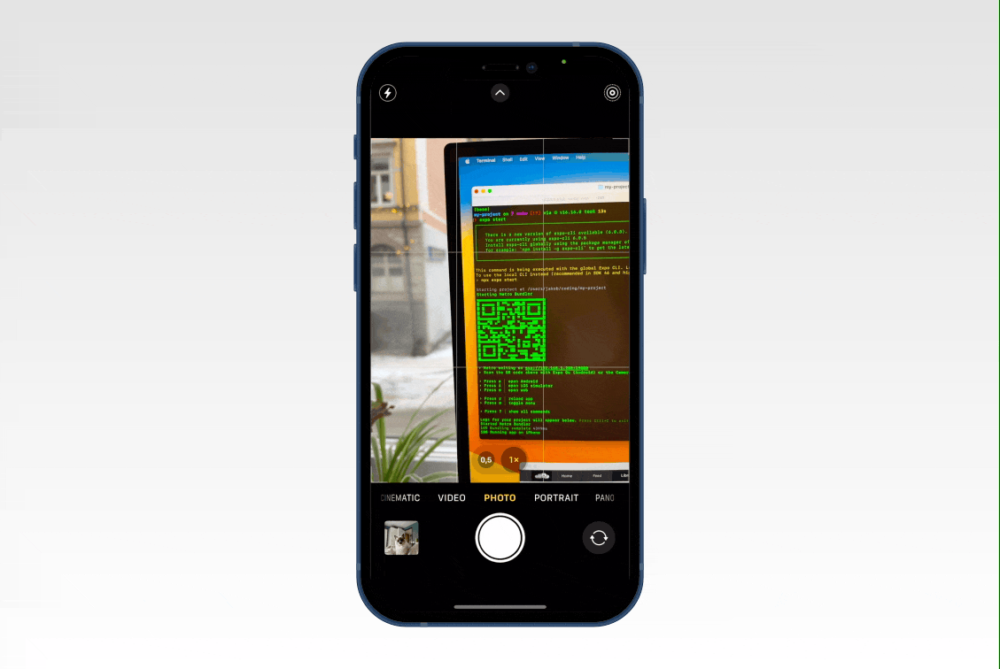
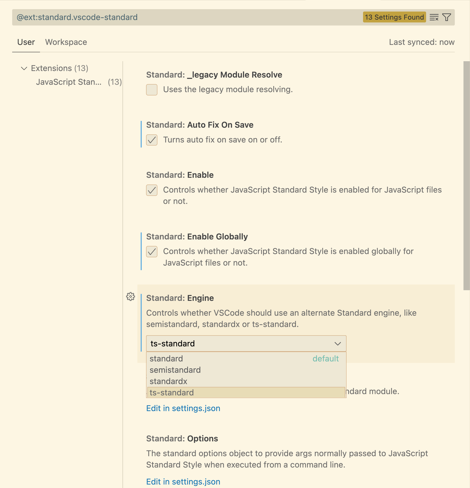

# Expo Typescript get started guide

This guide will help you get started building mobile applications using expo and typescript in React Native.

## What is expo?


Expo is a platform for building mobile applications that allow developers to quickly create native apps for both Android and iOS using a single codebase. It provides a set of tools, libraries, and services that allow developers to build and deploy their mobile applications with ease.

While Expo is built on top of the popular JavaScript framework React Native, it adds many ease-of-use features such as removing the requirement for Xcode or android studio and their respective files.

Expo also includes a suite of developer tools, such as a command-line interface (CLI) and a browser-based console, that makes it easy to build, test, and deploy mobile applications.

Overall, Expo is a useful platform for developers looking to build native mobile applications with minimal setup and effort. It allows developers to focus on building their apps without worrying about the underlying platform-specific details.

## What is typescript?

TypeScript is a programming language that is a strict syntactical superset of JavaScript, meaning that any valid JavaScript code is also valid TypeScript code. TypeScript was developed and is maintained by Microsoft.

One of the main features of TypeScript is its support for type annotations, which allow developers to specify the data types of variables, function parameters, and return values. This helps to catch type-related errors at compile time, rather than runtime and can make it easier to understand and maintain large codebases.

Here is an example of with and without typescript.
```js
function helloWorld () {
  return 'Hello world'
}
```
```ts
function helloWorld(): string {
  return 'Hello World'
}
```

Using typescript subsequent code can understand that `helloWorld` returns a string and can provide useful warnings and help when the developer tries to use it as something else.

## Prerequisites

1. Node.js: You will need to have Node.js and npm (the Node.js package manager) installed on your machine. You can download and install Node.js from the [offical website](https://nodejs.org/). If you are using a package manager like `brew` run `brew install node`
2. You will need a text editor. vscode is free, built on open source and runs everywhere. You can download it from the [official website](https://code.visualstudio.com) or install it using the brew package manager by running `brew` install `--cask visual-studio-code`

3. Download the [expo go app](https://expo.dev/client) on your iOS or Android smartphone. This will be used for running your app during development.

## Getting started with expo

1. Install the Expo CLI: The first step is to install the Expo command-line interface (CLI) on your computer. Open a terminal and run the following command:
```
npm install -g expo-cli
```
This will install the Expo CLI globally on your system, allowing you to use it to create and manage Expo projects from the command line.

2. Create a new project: Once the Expo CLI is installed, you can create a new Expo project by running the expo init command and specifying a name for your project. For example:

```sh
expo init my-project -t expo-template-blank-typescript
```

This will create a new directory with the name "my-project" and initialize a new Expo project inside it. The -t flag is used to specify what template to use. The blank typescript template will provide a minimal setup for your app.

3. Install dependencies: Navigate to your project directory (`cd my-project`) and run the following command to install the dependencies for your project:

```sh
npm install
```

This will install all the required packages and libraries for your project.

4. Run the project: To start the Expo development server and preview your app, run the following command:

```sh
expo start
```

This will open a new window in your browser with the Expo developer console.

5. Preview the app: You can preview your app in the Expo client app on your device by scanning the QR code displayed in the browser window with the Expo app (android) or regular camera app (iOS). You can also use an emulator to preview the app.



Now you have your development environment set up and you should see your application in the Expo client app.
 
## Optional add ts-standard linter

To enforce correct typings on everything as well as some defined style rules ts-standard can be used.

Install ts-standard by running
```sh
npm install ts-standard -D
```

Then install the standard plugin for vscode by clicking the extension's icon in the bar on the left (the one with 4 blocks).

Then search for standard and install the plugin `StandardJS - JavaScript Standard Style`

Once installed press the cogwheel and go to extension settings.

Here you can change the engine to ts-standard and enable `auto fix on save`.



To enable the module the first time you might need to restart vscode. You can do this by pressing `cmd + shift + p` and typing `reload` selecting `reload window` from the dropdown. Alternatively, you can simply quit and reopen the app.

Going to the `App.tsx` and saving the file will now automatically fix all auto-fixable problems. Now we only need to add a return type for the app component. This can be done by changing

```
export default function App () {
```

to

```
import { ReactElement } from 'react'

...

export default function App (): ReactElement {
```

At this point, you are ready to start development on your next app using expo typescript and ts-standard!