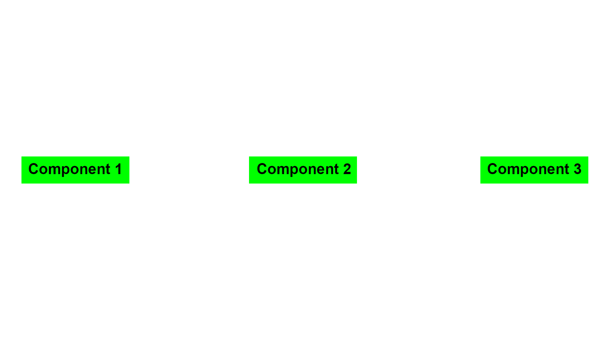

# Layout and Styles


## Import the View component:

In your React Native app, you can use the View component to define the layout of your user interface. To use the View component, you will need to import it from the react-native library. Add the following line at the top of your JavaScript file:
```js
import { View } from 'react-native'
```

## Use the View component:

The View component is used to define a container for other components. You can use it to create different types of layouts by specifying the flexDirection, justifyContent, and alignItems props. For example, the following code creates a View with a horizontal layout:

```js
<View style={{ flexDirection: 'row', justifyContent: 'space-between', alignItems: 'center' }}>
  {/* Components go here */}
</View>
```

## Nest View components:

You can nest multiple View components inside each other to create more complex layouts. For example, the following code creates a vertical layout with a header and a footer:

```js
<View style={{ flex: 1 }}>
  <View style={{ height: 50 }}>
    {/* Header components go here */}
  </View>
  <View style={{ flex: 1 }}>
    {/* Main content goes here */}
  </View>
  <View style={{ height: 50 }}>
    {/* Footer components go here */}
  </View>
</View>
```


## Use the `Text` component: 

The Text component is used to display text in your React Native app. To use the Text component, you will need to import it from the react-native library. Add the following line at the top of your TypeScript file:
```tsx
import { Text } from 'react-native'
```

You can then use the Text component to display text inside a View component like this:

```tsx
<View>
  <Text>Hello, world!</Text>
</View>
```

## Align components
To algin components in React Native, you can use the Flexbox layout system to align components within a container. Flexbox is a layout system that allows you to control the position and size of elements within a container by setting thier flex properties. 

To align components in React Native using Flexbox, you will need to use the View component and set the flexDirection, justifyContent, and alignItems props.

Here is an example of how to align components horizontally within a container using Flexbox in TypeScript:

```tsx
import React from 'react'
import { View, Text } from 'react-native'

const Container: React.FC = () => {
  return (
    <View style={{ flexDirection: 'row', justifyContent: 'space-between', alignItems: 'center' }}>
      <Text style={{ backgroundColor: 'green', padding: 10>Component 1</Text>
      <Text style={{ backgroundColor: 'green', padding: 10>Component 2</Text>
      <Text style={{ backgroundColor: 'green', padding: 10>Component 3</Text>
    </View>
  )
}
```
Which will render:


## Advanced Layout

Here is an advanced layout example using a `StyleSheet` instead to define the styles outside of the components itself, which is useful to avoid copied inline styles.

```tsx
import React from 'react'
import { View, Text, StyleSheet } from 'react-native'

const styles = StyleSheet.create({
  container: {
    flex: 1,
    flexDirection: 'column',
    justifyContent: 'space-between',
    alignItems: 'stretch',
  },
  topContainer: {
    flex: 1,
    backgroundColor: '#eee',
    alignSelf: 'stretch',
  },
  bottomContainer: {
    flex: 1,
    backgroundColor: '#ccc',
    alignSelf: 'stretch',
  },
  leftContainer: {
    flex: 1,
    backgroundColor: '#aaa',
  },
  rightContainer: {
    flex: 1,
    backgroundColor: '#888',
  },
  centerContainer: {
    flex: 2,
    backgroundColor: '#333',
    alignSelf: 'stretch',
  },
  text: {
    fontSize: 18,
    color: '#fff',
    textAlign: 'center',
  },
})

const AdvancedFlexboxLayout: React.FC = () => {
  return (
    <View style={styles.container}>
      <View style={styles.topContainer}>
        <Text style={styles.text}>Top Container</Text>
      </View>
      <View style={styles.bottomContainer}>
        <Text style={styles.text}>Bottom Container</Text>
      </View>
      <View style={{ flexDirection: 'row' }}>
        <View style={styles.leftContainer}>
          <Text style={styles.text}>Left Container</Text>
        </View>
        <View style={styles.centerContainer}>
          <Text style={styles.text}>Center Container</Text>
        </View>
        <View style={styles.rightContainer}>
          <Text style={styles.text}>Right Container</Text>
        </View>
      </View>
    </View>
  )
}

export default AdvancedFlexboxLayout
```
This code creates a layout with three main sections: a top container, a bottom container, and a middle section with a left, center, and right container. The top and bottom containers are stacked vertically, and the middle section is a row with the left and right containers on either side of the center container.

The `flexDirection` property on the root `View` element is set to `column`, which arranges the children vertically. The `justifyContent` property is set to `space-between`, which distributes the space between the top and bottom containers evenly. The `alignItems` property is set to `stretch`, which causes the top and bottom containers to stretch to fill the available space.

The middle section is a row, with the `flexDirection` property set to row. The `alignSelf` property is set to `stretch` on the center container, causing it to stretch to fill the available space.

Flexbox is implemented the same way on the web, so you can test different flex properties on your own by using the web [here](https://coding.imweb.io/demo/flex/index.html).