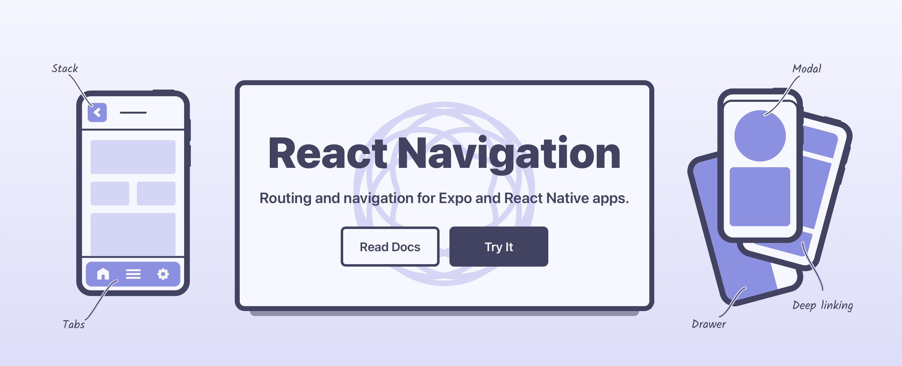

# React Native navigation



In order to add pages and tab bars to your application you need to add a navigation library.

In the guide we will write all components using typescript. If you need help setting up or understanding typescript please refer to the [README.md](https://github.com/3DJakob/expo-typescript-get-started-guide).

## Prerequisites

This guide assumes that you have already setup your typescript expo development enviroment.

## Installation

Install react-navigation with the following command:

```sh
npm install @react-navigation/native
```

If you are using expo you will also need the following deependecies

```sh
npx expo install react-native-screens react-native-safe-area-context
```

## Implementation

**1. Adding a `<NavigationContainer>`**

Start by wrapping your app in a `<NavigationContainer>`. This is neccessary to use any of the navigation components and functions inside tha app later. Your App.tsx should look something like this:

```tsx
import * as React from 'react'
import { NavigationContainer } from '@react-navigation/native'
import { ReactElement } from 'react'

export default function App (): ReactElement {
  return (
    <NavigationContainer>
      {/* Rest of your app code */}
    </NavigationContainer>
  )
}
```

**2. Creating your first stack**

Stacks are used to arrange multiple screens in a stack where the user can push new views or pop the current one. This is used whenever you can swipe from the left of the screen to go back on iOS or with the back button on android.

We first need to install the stack package.

```sh
npm install @react-navigation/native-stack
```

Once installed we can expand our code in `App.tsx`

```tsx
import * as React from 'react'
import { NavigationContainer } from '@react-navigation/native'
import { createNativeStackNavigator } from '@react-navigation/native-stack'
import { ReactElement } from 'react'
import { Text } from 'react-native'

function Home (): ReactElement {
  return (
    <Text>Home Screen</Text>
  )
}

const Stack = createNativeStackNavigator()

export default function App (): ReactElement {
  return (
    <NavigationContainer>
      <Stack.Navigator>
        <Stack.Screen name='Home' component={Home} />
      </Stack.Navigator>
    </NavigationContainer>
  )
}
```

In this case it would be wise to move the `Home` component to a separate file called `Home.tsx` in a directory called `pages`.

TIP: You can hide the navigation bar to render your own using the following code.

```tsx
<Stack.Navigator
  screenOptions={{
    headerShown: false
  }}>
  <Stack.Screen name='Home' component={Home} />
</Stack.Navigator>
```

**3. Adding multiple routes to a stack**

You can add more routes to a stack with the following code:

```tsx
<NavigationContainer>
  <Stack.Navigator initialRouteName='Home'>
    <Stack.Screen name='Home' component={Home} />
    <Stack.Screen name='Profile' component={Profile} />
  </Stack.Navigator>
</NavigationContainer>
```

With the `initialRouteName` prop we can define what route should be displayed once the stack first loads.

**4. Navigating**

Navigation between screens can be done using the `useNavigate` hook. In your `Home.tsx` file we can add the following code.

```tsx
import { useNavigation } from '@react-navigation/native'
import React, { ReactElement } from 'react'
import { Text, TouchableOpacity } from 'react-native'

function Home (): ReactElement {
  const navigation = useNavigation()

  return (
    <TouchableOpacity onPress={() => navigation.navigate('Profile')}>
      <Text>Go to profile</Text>
    </TouchableOpacity>
  )
}

export default Home
```

This should allow you to navigate to your Profile screen. You can also pass parameters using the second argument to navigation.navigate.

```tsx
navigation.navigate('Profile', {foo: 'bar'})
```

These parameters can then be captured using

```tsx
import { useRoute } from '@react-navigation/native'

...

const params = useRoute().params as { foo: string }
console.log(params.foo)
```

in Profile.tsx.


To go back to the previous screen execute:

```tsx
navigation.goBack()
```


**5. Using a tab bar navigator**

Optionally you could add a tab navigator. That way the user can navigate between screens uning a tab bar in the bottom of the application.

Install the tab navigator using the following command:

```
npm install @react-navigation/bottom-tabs
```

Then use

```tsx
const Tab = createBottomTabNavigator()
```

to create a tab navigator.

Inide your `<NavigationContainer>` just add the following code.

```tsx
<Tab.Navigator>
  <Tab.Screen name='Home' component={Home} />
  <Tab.Screen name='Profile' component={Profile} />
</Tab.Navigator>
```

Hopefully you should now have a application with working navigation. For more information and guides check out [reactnavigation.org](https://reactnavigation.org/).